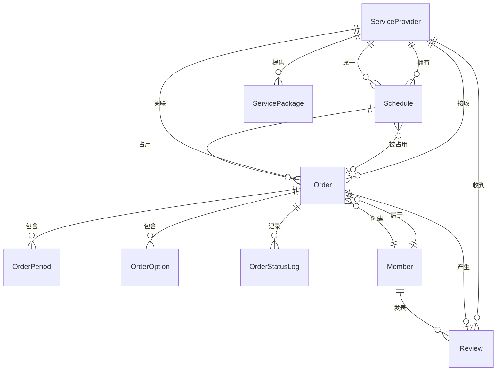

# 婚庆管家 - 系统设计总纲

**项目名称**: 婚庆管家（Wedding Host Manager）  
**版本**: v2.0.0  
**创建日期**: 2025-01-03  
**最后更新**: 2025-01-03

---

## 一、文档说明

本文档是系统架构设计的核心总纲，定义了：
- **系统边界**：明确核心域、支撑域、通用域
- **领域模型**：核心业务实体的关系与约束
- **状态机定义**：正式化的状态迁移规则
- **系统约束**：统一架构原则，确保API设计、数据库设计、业务流程三者一致

**文档关系**：
- 本文档统领所有其他设计文档
- API设计、数据库设计、业务流程必须遵循本文档的约束
- 状态流转、并发控制、权限校验均基于本文档定义

---

## 二、系统边界定义

### 2.1 核心域（Core Domain）

**定义**：系统业务价值所在，包含核心业务逻辑和规则。

#### 2.1.1 Order（订单域）

**职责**：
- 订单生命周期管理
- 订单状态流转控制
- 订单金额计算与校验
- 订单业务规则执行

**边界**：
- 订单创建、审核、完成、取消、退款
- 订单状态机管理
- 订单与档期的关联关系

**不包含**：
- 支付流程（支撑域）
- 用户认证（通用域）

#### 2.1.2 Schedule（档期域）

**职责**：
- 服务提供者时间资源管理
- 档期冲突检测与预防
- 档期状态控制

**边界**：
- 档期创建、更新、锁定、释放
- 时间段重叠检测
- 并发占用控制

**不包含**：
- 订单业务逻辑（订单域）
- 服务提供者基本信息（支撑域）

#### 2.1.3 Provider（服务提供者域）

**职责**：
- 服务提供者信息管理
- 服务套餐与价格管理
- 服务提供者能力展示

**边界**：
- 服务提供者基本信息
- 服务套餐定义
- 服务类型扩展

**不包含**：
- 订单管理（订单域）
- 用户认证（通用域）

### 2.2 支撑域（Supporting Domain）

**定义**：为核心域提供支撑服务，但不直接产生业务价值。

#### 2.2.1 Member（用户域）

**职责**：
- 用户身份认证
- 用户权限管理
- 用户信息维护

#### 2.2.2 Payment（支付域）

**职责**：
- 支付状态管理
- 付款凭证管理
- 支付流程协调

**说明**：系统不集成第三方支付，仅管理支付状态和凭证。

#### 2.2.3 Review（评价域）

**职责**：
- 评价内容管理
- 评价审核流程
- 评价统计计算

### 2.3 通用域（Generic Domain）

**定义**：通用技术能力，可被多个域复用。

- **消息通知**：系统消息、业务通知
- **内容管理**：公告、轮播图
- **文件上传**：图片、视频上传
- **配置管理**：系统配置、业务规则配置

---

## 三、领域模型

### 3.1 核心实体关系图



### 3.2 实体定义

#### 3.2.1 ServiceProvider（服务提供者）

**属性**：
- `id`: 主键
- `service_type`: 服务类型（host/photographer/butler）
- `realname`: 真实姓名
- `status`: 状态（正常/禁用）

**业务规则**：
- 服务类型创建后不可修改
- 删除采用逻辑删除，保留历史数据

#### 3.2.2 Order（订单）

**属性**：
- `id`: 主键
- `order_no`: 订单编号（唯一）
- `order_status`: 业务主状态（生命周期）
- `payment_status`: 支付状态
- `refund_status`: 退款状态
- `total_amount`: 订单总额

**业务规则**：
- 订单编号创建后不可修改
- 订单状态必须通过状态机流转
- 终态订单永久保留，不支持逻辑删除

**状态组合规则**：
- `order_status` + `payment_status` + `refund_status` 共同决定订单完整状态
- 状态组合必须符合业务规则（见状态机定义）

#### 3.2.3 Schedule（档期）

**属性**：
- `id`: 主键
- `provider_id`: 服务提供者ID
- `date`: 日期
- `start_time`: 开始时间
- `end_time`: 结束时间
- `period`: 场次类型（仅用于前端展示）
- `status`: 档期状态（空闲/休息/已预订）

**业务规则**：
- 系统业务判断以 `start_time` + `end_time` 为准
- `period` 仅用于前端快速选择和展示，不参与业务判断
- 档期冲突检测基于时间段重叠（start_time, end_time）
- 档期记录永久保留，不支持逻辑删除

#### 3.2.4 OrderStatusLog（订单状态日志）

**属性**：
- `id`: 主键
- `order_id`: 订单ID
- `from_status`: 原状态
- `to_status`: 新状态
- `operator_type`: 操作人类型
- `operator_id`: 操作人ID

**业务规则**：
- 所有状态变更必须记录日志
- 日志永久保留，用于历史追溯

---

## 四、状态机定义

### 4.1 订单状态机

#### 4.1.1 状态定义

**业务主状态（order_status）**：
- `CREATED(0)`: 待审核
- `CONFIRMED(1)`: 已同意
- `SERVING(3)`: 待服务
- `FINISHED(4)`: 已完成
- `REJECTED(10)`: 已拒绝（终态）
- `CANCELLED(11)`: 已取消（终态）
- `CLOSED(13)`: 已关闭（终态）

**支付状态（payment_status）**：
- `UNPAID(0)`: 未付款
- `PAID(1)`: 已付款
- `PARTIAL_REFUND(2)`: 部分退款
- `FULL_REFUND(3)`: 已退款

**退款状态（refund_status）**：
- `NONE(0)`: 无退款
- `APPLY(1)`: 退款申请中
- `APPROVED(2)`: 退款已同意
- `REJECTED(3)`: 退款已拒绝
- `COMPLETED(4)`: 退款已完成

#### 4.1.2 状态迁移矩阵

| FROM (order_status) | TO (order_status) | ALLOWED_ROLE | API | 前置条件 | 后置动作 |
|---------------------|-------------------|--------------|-----|---------|---------|
| CREATED(0) | CONFIRMED(1) | provider | POST /api/v1/order/approve | order_status=0, payment_status=0 | 发送通知给用户 |
| CREATED(0) | REJECTED(10) | provider | POST /api/v1/order/reject | order_status=0 | 释放档期，发送通知 |
| CREATED(0) | CANCELLED(11) | user | POST /api/v1/order/cancel | order_status=0 | 释放档期，发送通知 |
| CREATED(0) | CLOSED(13) | admin | POST /admin/order/close | order_status=0 | 释放档期，发送通知 |
| CONFIRMED(1) | SERVING(3) | system | 自动流转 | order_status=1, payment_status=1 | 发送通知 |
| CONFIRMED(1) | CANCELLED(11) | user | POST /api/v1/order/cancel | order_status=1 | 释放档期，发送通知 |
| CONFIRMED(1) | CLOSED(13) | admin | POST /admin/order/close | order_status=1 | 释放档期，发送通知 |
| SERVING(3) | FINISHED(4) | provider | POST /api/v1/order/complete | order_status=3 | 发送通知，允许评价 |
| SERVING(3) | SERVING(3) | user | POST /api/v1/order/refund | order_status=3, refund_status=0 | 设置refund_status=APPLY(1) |
| SERVING(3) | CLOSED(13) | admin | POST /admin/order/close | order_status=3 | 发送通知 |

**支付状态迁移**：

| FROM (payment_status) | TO (payment_status) | ALLOWED_ROLE | API | 前置条件 | 后置动作 |
|----------------------|---------------------|--------------|-----|---------|---------|
| UNPAID(0) | PAID(1) | admin | POST /admin/order/confirmPayment | order_status=CONFIRMED(1) | 自动流转order_status=SERVING(3) |
| PAID(1) | PARTIAL_REFUND(2) | admin | POST /admin/order/confirmRefund | refund_status=APPROVED(2) | - |
| PAID(1) | FULL_REFUND(3) | admin | POST /admin/order/confirmRefund | refund_status=COMPLETED(4) | - |

**退款状态迁移**：

| FROM (refund_status) | TO (refund_status) | ALLOWED_ROLE | API | 前置条件 | 后置动作 |
|---------------------|---------------------|--------------|-----|---------|---------|
| NONE(0) | APPLY(1) | user | POST /api/v1/order/refund | order_status=SERVING(3) | 发送通知给管理员 |
| APPLY(1) | APPROVED(2) | admin | POST /admin/order/auditRefund | refund_status=APPLY(1) | 发送通知给用户 |
| APPLY(1) | REJECTED(3) | admin | POST /admin/order/auditRefund | refund_status=APPLY(1) | 发送通知给用户 |
| APPROVED(2) | COMPLETED(4) | admin | POST /admin/order/confirmRefund | refund_status=APPROVED(2) | 更新payment_status，释放档期（部分退款时） |
  - **释放档期逻辑**（部分退款时）：
    - 解析退款申请的 `refund_items` JSON字段
    - 对于 `type="period"` 的退款项，通过 `period_id` 找到对应的 `wedding_order_period` 记录
    - 根据订单的 `reservation_date` 和 `order_period` 中的场次信息，反向查找对应的档期记录（通过 `provider_id + date + start_time + end_time` 匹配）
    - 将对应档期记录的 `order_id` 置为 0，`status` 置为 0（空闲）
    - **重要**：只释放 `refund_items` 里指定的场次档期，未退款的场次档期保持已预订状态

#### 4.1.3 状态组合规则

**合法状态组合**：

| order_status | payment_status | refund_status | 业务含义 |
|-------------|----------------|---------------|---------|
| CREATED(0) | UNPAID(0) | NONE(0) | 待审核，未付款 |
| CONFIRMED(1) | UNPAID(0) | NONE(0) | 已同意，待付款 |
| CONFIRMED(1) | PAID(1) | NONE(0) | 已同意，已付款（自动流转为SERVING） |
| SERVING(3) | PAID(1) | NONE(0) | 待服务，已付款 |
| SERVING(3) | PAID(1) | APPLY(1) | 待服务，已付款，退款申请中 |
| SERVING(3) | PAID(1) | APPROVED(2) | 待服务，已付款，退款已同意 |
| SERVING(3) | PARTIAL_REFUND(2) | COMPLETED(4) | 待服务，部分退款已完成 |
| SERVING(3) | FULL_REFUND(3) | COMPLETED(4) | 待服务，已退款（应流转为CANCELLED） |
| FINISHED(4) | PAID(1) | NONE(0) | 已完成，已付款 |
| REJECTED(10) | UNPAID(0) | NONE(0) | 已拒绝，未付款（终态） |
| CANCELLED(11) | UNPAID(0) | NONE(0) | 已取消，未付款（终态） |
| CANCELLED(11) | PAID(1) | COMPLETED(4) | 已取消，已退款（终态） |

**非法状态组合示例**：
- `order_status=CREATED(0)` + `payment_status=PAID(1)` ❌（待审核状态不能已付款）
- `order_status=FINISHED(4)` + `refund_status=APPLY(1)` ❌（已完成订单不能申请退款）

### 4.2 档期状态机

| FROM | TO | ALLOWED_ROLE | API | 前置条件 | 后置动作 |
|------|----|--------------|-----|---------|---------|
| FREE(0) | REST(1) | provider | POST /api/v1/schedule/set | status=FREE(0) | - |
| FREE(0) | BOOKED(2) | system | 订单创建时自动 | status=FREE(0), 档期可用 | 关联order_id |
| REST(1) | FREE(0) | provider | POST /api/v1/schedule/set | status=REST(1) | - |
| BOOKED(2) | FREE(0) | system | 订单取消/拒绝时自动 | status=BOOKED(2) | 清空order_id |

---

## 五、系统约束

### 5.1 架构一致性约束

**约束1：API设计必须遵循状态机定义**
- 所有状态变更接口必须通过状态机校验
- 不允许直接修改状态字段
- 状态变更必须记录日志

**约束2：数据库设计必须支持状态机**
- 状态字段必须符合状态机定义
- 状态变更必须通过业务方法，禁止直接UPDATE
- 状态日志表必须记录所有变更

**约束3：业务流程必须符合状态机**
- 业务流程文档中的状态流转必须与状态机定义一致
- 异常场景处理必须考虑状态机约束

### 5.2 并发控制约束

**约束1：档期占用必须使用唯一索引**
- 数据库唯一索引：`uk_provider_date_time` (provider_id, date, start_time, end_time)
- 应用层使用事务 + 行锁（SELECT FOR UPDATE）
- 冲突时返回明确错误码（3001）

**约束2：订单状态变更必须使用锁**
- 状态变更前必须锁定订单记录（SELECT FOR UPDATE）
- 检查状态是否已变更
- 状态变更必须记录日志

**约束3：幂等性必须通过唯一索引保证**
- 订单创建：`member_id + client_request_id` 联合唯一索引
- 退款申请：`member_id + client_request_id` 联合唯一索引

### 5.3 数据生命周期约束

**约束1：订单数据永久保留**
- 订单表不支持逻辑删除
- 终态订单永久保留
- 状态日志永久保留

**约束2：档期数据永久保留**
- 档期表不支持逻辑删除
- 所有档期记录永久保留，用于历史追溯

**约束3：逻辑删除数据不参与唯一约束**
- 逻辑删除的数据仍保持唯一性
- 例如：`wedding_service_provider.provider_no` 唯一索引，逻辑删除后仍唯一

### 5.4 错误处理约束

**约束1：错误码必须分段管理**
- 1xxx：参数错误
- 2xxx：订单模块
- 3xxx：档期模块
- 4xxx：支付/退款模块
- 5xxx：评价模块
- 6xxx：动态模块
- 7xxx：服务提供者模块
- 8xxx：内容模块
- 9xxx：系统级错误

**约束2：错误响应必须包含详细信息**
- 错误码
- 错误消息
- 错误详情（当前状态、允许操作等）

---

## 六、领域模型详细说明

### 6.1 Order（订单）领域模型

**聚合根**：Order

**实体**：
- OrderPeriod（订单场次）
- OrderOption（订单增值服务）
- OrderStatusLog（订单状态日志）

**值对象**：
- OrderAmount（订单金额）
- OrderContact（订单联系信息）

**业务规则**：
1. 订单创建时必须校验档期可用性
2. 订单状态变更必须通过状态机
3. 订单金额计算必须基于快照数据
4. 订单取消/拒绝时必须释放档期

### 6.2 Schedule（档期）领域模型

**聚合根**：Schedule

**业务规则**：
1. 档期冲突检测基于时间段重叠（start_time, end_time）
2. 档期状态变更必须通过业务方法
3. 档期被订单占用时，不能修改状态
4. 订单取消/拒绝时，自动释放档期

### 6.3 Provider（服务提供者）领域模型

**聚合根**：ServiceProvider

**实体**：
- ServicePackage（服务套餐）
- ServiceAddon（增值服务）

**业务规则**：
1. 服务类型创建后不可修改
2. 服务套餐有订单关联后，价格和模式不可修改
3. 服务提供者删除采用逻辑删除

---

## 七、系统扩展性设计

### 7.1 服务类型扩展

**设计原则**：
- 服务类型来源于数据库配置（`wedding_service_type`）
- 核心业务逻辑不依赖具体类型名称
- 新增服务类型仅需配置数据和扩展服务实现

**扩展步骤**：
1. 在 `wedding_service_type` 表中添加新类型
2. 扩展 `ServiceProviderServiceFactory` 添加新服务实现
3. 无需修改核心业务代码

### 7.2 状态扩展

**设计原则**：
- 状态定义通过代码枚举类管理
- 状态机定义通过配置或代码定义
- 新增状态必须更新状态机定义

**扩展步骤**：
1. 在枚举类中添加新状态
2. 在状态机定义中添加状态迁移规则
3. 更新相关文档

### 7.3 档期规则扩展

**设计原则**：
- 档期模型支持任意时间段
- 固定场次仅作为默认模板
- 新增档期规则无需修改数据库结构

---

## 八、文档关系图

```
00-系统设计总纲.md (本文档)
    │
    ├── 01-项目开发文档.md (技术选型、目录结构)
    │
    ├── 02-数据库设计文档.md (表结构，必须遵循领域模型)
    │
    ├── 03-API接口设计文档.md (接口定义，必须遵循状态机)
    │
    ├── 04-业务流程文档.md (业务流程，必须符合状态机)
    │
    ├── 08-数据字段字典.md (字段枚举，必须符合状态定义)
    │
    ├── 09-术语与命名统一表.md (术语统一)
    │
    ├── 10-异常与边界场景说明.md (错误处理，必须符合错误码规范)
    │
    └── 11-状态机定义文档.md (详细状态机定义，本文档的细化)
```

---

## 九、版本历史

| 版本 | 日期 | 说明 |
|-----|------|------|
| v2.0.0 | 2025-01-03 | 初始版本，系统架构升级 |

---

**文档版本**: v2.0.0  
**最后更新**: 2025-01-03

